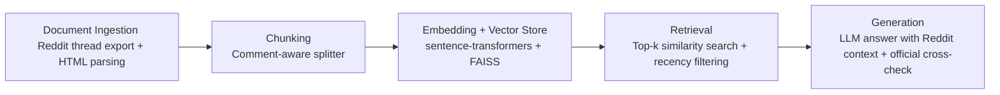

# Project 1 Planning: The Unofficial Guide

> Write this document before you write any pipeline code.
> Your spec and architecture diagram are what you'll use to direct AI tools (Claude, Copilot, etc.) to generate your implementation — the more specific they are, the more useful the generated code will be.
> Update the Retrieval Approach and Chunking Strategy sections if you change your approach during implementation.
> Update this file before starting any stretch features.

---

## Domain

Northeastern off-campus housing. This domain is valuable because students need practical, time-sensitive help finding apartments, roommates, and sublets near campus, and the most useful information is split across Northeastern resources, Boston housing guidance, rental databases, and scam-avoidance pages.

---

## Documents

<!-- List your specific sources: URLs, subreddit names, forum threads, or file descriptions.
     Aim for at least 10 sources that together cover different subtopics or perspectives within your domain. -->

| # | Source | Description | URL or location |
|---|--------|-------------|-----------------|
| 1 | Northeastern Off-Campus Engagement and Support - Renting in Boston | Details about renting in Boston neigborhoods | https://offcampus.housing.northeastern.edu/get-started/neighborhoods/ |
| 2 | Northeastern Off-Campus Housing FAQS | Answers for questions related to finding houses, roommates, subletting, etc. | https://offcampus.housing.northeastern.edu/advising-and-support-resources/discussfrequently-asked-questions/ |
| 3 | Renting in Boston | Webpage containing the official guide in renting in Boston | https://www.boston.gov/renting-boston |
| 4 | Top Neighborhoods for NEU Students | A blog post outlining areas for NEU students to live in | https://offcampusapartmentfinder.com/top-neighborhoods-for-northeastern-students-living-off%E2%80%91campus/ |
| 5 | Northeastern OGS International Student Guide | Guidance for international students and temporary housing advice | https://bpb-us-e1.wpmucdn.com/sites.northeastern.edu/dist/1/555/files/2023/06/InternationalStudentBrochure2023-FINAL.pdf |
| 6 | Off-campus Housing Guide | An unofficial guide by Spot Easy for NEU students | https://www.spoteasy.com/blog/how-does-off-campus-housing-near-northeastern-actually-work |
| 7 | Northeastern scam guide article | Detailed red flags and verification steps for apartment scams | https://offcampus.housing.northeastern.edu/explore-housing-options/rental-scams/ |
| 8 | Massachusetts landlord-tenant law | Broker fee rule and tenant protections | https://www.mass.gov/info-details/massachusetts-law-about-landlord-and-tenant |
| 9 | Boston broker fee guidance | City guidance on the updated broker fee law | https://www.boston.gov/departments/housing/office-housing-stability/broker-fees-3-things-know-about-new-law |
| 10 | NEU Housing Megathread on Reddit | Housing and roommate solicitation | https://www.reddit.com/r/NEU/comments/11eo62e/megathread_please_post_all_housing_and_roommate/ |

---

## Chunking Strategy

<!-- How will you split documents into chunks?
     State your chunk size (in tokens or characters), overlap size, and explain why those
     numbers fit the structure of your documents.
     A review-heavy corpus warrants different chunking than a long FAQ. -->

**Chunk size:**
350 tokens (1 400 chars). Spec range: 300–600 tokens.

**Overlap:**
100 tokens (400 chars). Spec range: 100–150 tokens.

**Reasoning:**
Reddit comments are short, conversational, and often split across replies, so smaller chunks work better than for formal policy docs. The overlap helps preserve the back-and-forth context in housing threads. Other documents mix step-by-step instructions, FAQs, policy details, and listings, so moderate chunks help keep a whole policy section or checklist item together without making retrieval too broad.

**Implementation note (updated after chunking run):**
Initial implementation used 450-token chunks (spec midpoint), which produced 45 chunks across 8 available documents — below the 50-chunk minimum for meaningful retrieval. Reduced to 350 tokens (lower end of spec range, still within 300–600) to produce 57 chunks. The Reddit megathread and remaining blocked sources are not yet available; when added they will substantially increase the chunk count, so no further adjustment is expected.

---

## Retrieval Approach

<!-- Which embedding model are you using (e.g., all-MiniLM-L6-v2 via sentence-transformers)?
     How many chunks will you retrieve per query (top-k)?
     If you were deploying this for real users and cost wasn't a constraint, what tradeoffs
     would you weigh in choosing a different embedding model — context length, multilingual
     support, accuracy on domain-specific text, latency? -->

**Embedding model:**
- all-MiniLM-L6-v2 via sentence-transformers.

**Top-k:**
- 5 chunks per query

**Production tradeoff reflection:**
- I would consider a stronger embedding model because Reddit language is noisy, informal, and full of shorthand like “off-campus,” “sublet,” “T line,” and “brokers fee.” Higher accuracy matters more than speed here because students care about matching their exact situation, such as budget, commute distance, or whether they need a summer sublet.
---

## Evaluation Plan

<!-- List your 5 test questions with their expected correct answers.
     Questions should be specific enough that you can judge whether the system's response
     is right or wrong. "What are good dining halls?" is too vague.
     "What do students say about wait times at [dining hall name] during lunch?" is testable. -->

| # | Question | Expected answer |
|---|----------|-----------------|
| 1 | What housing search tool does Northeastern recommend?| The NU Housing Database / aptsearch portal   |
| 2 | What is a common off-campus housing strategy for co-op students?| Look for 4-6 month sublets, since the subletting market is large  |
| 3 | What commute advice do students give? | Expand searches along the T lines if commuting is possible  |
| 4 | What social media apps can students use for housing leads? | In the thread, students say off-campus help is often found in Facebook groups, while Reddit is useful for advice and discussion  |
| 5 | What do students say about broker fees near Northeastern?| They often say broker fees are common and can equal about one month’s rent, though law and policy should be checked against official sources  |

---

## Anticipated Challenges

<!-- What could go wrong? Name at least two specific risks with reasoning.
     Consider: noisy or inconsistent documents, missing source attribution, off-topic
     retrieval, chunks that split key information across boundaries. -->

1. Reddit comments are noisy and contradictory, so the system may retrieve opinionated advice that conflicts with official Northeastern or legal guidance.

2. Some sources are policy-heavy while others are listing-heavy, so chunks may retrieve the wrong kind of answer for a query unless the system distinguishes between “how-to,” “safety,” and “search results” content.

---

## Architecture

<!-- Draw a diagram of your pipeline showing the five stages:
     Document Ingestion → Chunking → Embedding + Vector Store → Retrieval → Generation
     Label each stage with the tool or library you're using.
     You can use ASCII art, a Mermaid diagram, or embed a sketch as an image.
     You'll use this diagram as context when prompting AI tools to implement each stage. -->

---

## AI Tool Plan

<!-- For each part of the pipeline below, describe:
     - Which AI tool you plan to use (Claude, Copilot, ChatGPT, etc.)
     - What you'll give it as input (which sections of this planning.md, which requirements)
     - What you expect it to produce
     - How you'll verify the output matches your spec

     "I'll use AI to help me code" is not a plan.
     "I'll give Claude my Chunking Strategy section and ask it to implement chunk_text()
     with my specified chunk size and overlap" is a plan. -->

**Milestone 3 — Ingestion and chunking:**
I’ll use Claude with the Domain, Documents, and Chunking Strategy sections to build a parser for Reddit threads and comment trees. I expect it to preserve parent-child comment context and filter out irrelevant chatter, and I’ll verify this by checking whether each chunk still contains a coherent housing discussion.

**Milestone 4 — Embedding and retrieval:**
I’ll use Claude with the Retrieval Approach and Evaluation Plan sections. I expect it to create retrieval code that finds relevant comment clusters for questions about broker fees, sublets, commute advice, and apartment search tools, and I’ll test it against the five evaluation questions.

**Milestone 5 — Generation and interface:**
I’ll use Claude with the Architecture and Evaluation Plan sections to generate answers and a simple interface. I expect it to summarize Reddit advice carefully, flag uncertainty, and cross-check important claims against Northeastern and Massachusetts sources when needed.